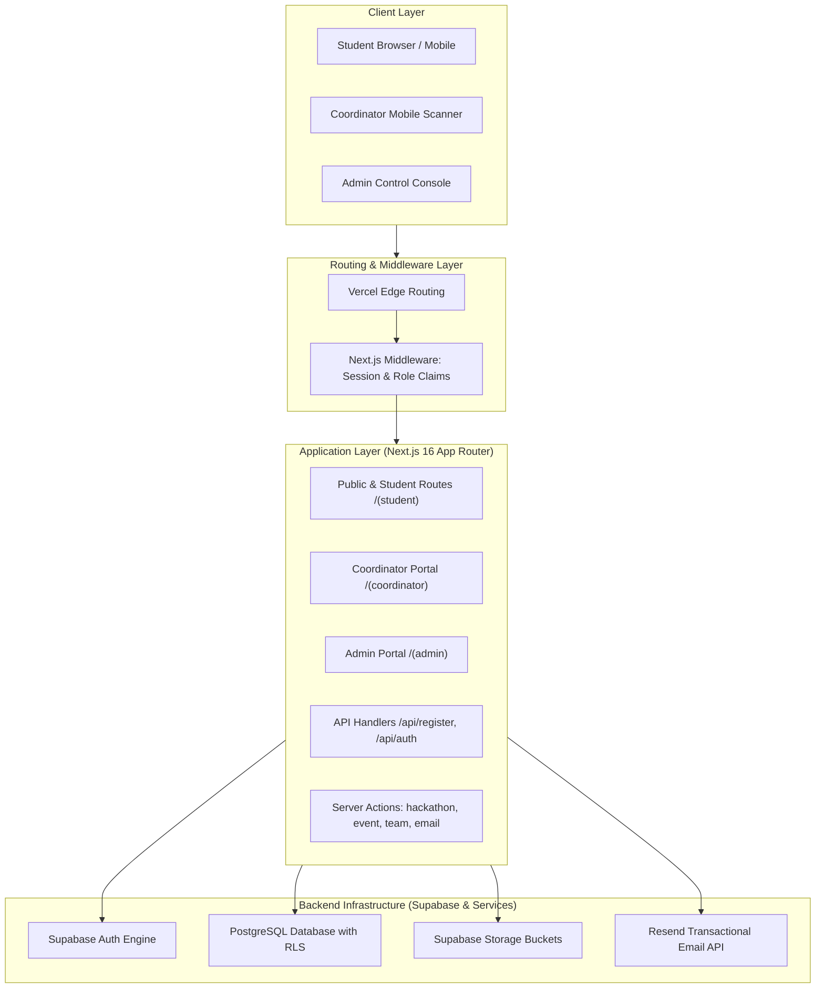
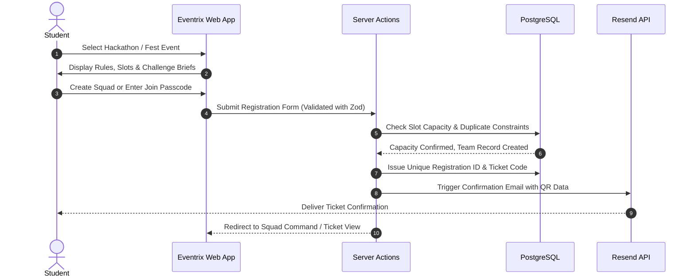
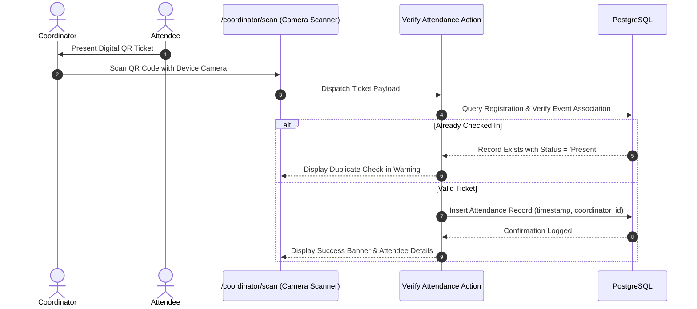

<p align="center">
  
</p>

<h1 align="center">Eventrix</h1>

<p align="center">
  <strong>Enterprise Campus Event & Hackathon Orchestration Engine</strong>
</p>

<p align="center">
  A full-stack, role-based platform engineered for collegiate symposia and multi-track hackathons, integrating squad collaboration, automated QR ticketing, real-time venue attendance validation, and administrative telemetry.
</p>

<p align="center">
  <a href="https://sona-eventrix-itads.vercel.app"></a>
  <a href="https://nextjs.org"></a>
  <a href="https://react.dev"></a>
  <a href="https://www.typescriptlang.org"></a>
  <a href="https://tailwindcss.com"></a>
  <a href="https://supabase.com"></a>
  <a href="https://resend.com"></a>
</p>

---

## Technology Stack

<p align="center">
  
  &nbsp;&nbsp;&nbsp;&nbsp;
  
  &nbsp;&nbsp;&nbsp;&nbsp;
  
  &nbsp;&nbsp;&nbsp;&nbsp;
  
  &nbsp;&nbsp;&nbsp;&nbsp;
  
  &nbsp;&nbsp;&nbsp;&nbsp;
  
  &nbsp;&nbsp;&nbsp;&nbsp;
  
  &nbsp;&nbsp;&nbsp;&nbsp;
  
</p>

| Architecture Layer | Core Technology | Implementation Scope |
| :--- | :--- | :--- |
| Framework | Next.js 16 (App Router) | Server Components, Server Actions, Route Handlers, Edge Middleware |
| UI Runtime | React 19 | Client interactive interfaces, concurrent state rendering, hooks |
| Language | TypeScript 5 | Strict end-to-end type safety across schemas, actions, and UI props |
| Styling & Theme | Tailwind CSS v4, Lucide React | High-performance CSS engine, tokenized design system, vector iconography |
| Database | PostgreSQL (Supabase Engine) | Relational schema, foreign key cascades, composite indexes, triggers |
| Authentication | Supabase Auth (`@supabase/ssr`) | Cookie-based session management, JWT token validation, role claims |
| Cloud Storage | Supabase Storage | Problem statement PDF brief distribution, event banners, team badges |
| Email Dispatch | Resend API | Transactional registration confirmations, automated ticket delivery |
| Ticket Verification | HTML5 QR Code, QRCode.react | Client camera scanner integration, cryptographically structured ticket payloads |
| Hosting & Edge | Vercel Platform | Continuous deployment, serverless compute functions, global asset delivery |

---

## Project Overview

Eventrix is a purpose-built event management and hackathon administration platform created to replace decentralized, error-prone manual workflows in institutional symposia. Conventional event operations frequently suffer from duplicate spreadsheets, ticket counterfeiting, unverified team capacities, and chaotic physical queues on event day.

Eventrix addresses these challenges through a centralized web platform that:

* Delivers an integrated student portal for exploring inter-departmental technical and non-technical symposium tracks.
* Houses a dedicated Hackathon Command Center featuring squad formation via cryptographic passcodes, slot tracking, and specification brief distribution.
* Enforces strict team capacity boundaries and duplicate entry prevention at the database engine level.
* Dispatches cryptographically unique QR tickets directly to participants upon verified registration.
* Equips event coordinators with an in-browser camera scanner for frictionless, sub-second venue check-ins.
* Gives institutional administrators real-time analytics, participant rosters, and configuration control across all active initiatives.

---

## Key Features

### Multi-Track Hackathon Command (Squad HQ)
* Real-Time Telemetry: Live countdown timer, squad slot capacity meters, domain categorization, and venue status.
* Squad Lifecycle: Self-service team creation, unique join passcode generation, and direct member invitations.
* Problem Statement Repository: Challenge tracks with downloadable specification briefs and search filtering.
* Compliance Matrix: Dynamic rendering of Rules & Regulations, Participation Guidelines, Submission Guidelines, Judging Criteria, and Codes of Conduct.

### Fest & Sub-Event Registration Pipeline
* Inter-Departmental Discovery: Filtering across technical, non-technical, and flagship fest categories.
* Registration Guards: Enforcement of minimum technical and non-technical selection thresholds per fest.
* Individual & Team Support: Handles both solo entries and dynamic multi-candidate team rosters.
* Deduplication Engine: PostgreSQL unique constraints prevent duplicate submissions across email addresses and event IDs.

### Cryptographic QR Ticketing & Venue Attendance
* Dynamic QR Ticket Engine: Automatically renders signed ticket codes encodeable into downloadable, wallet-style digital tickets.
* In-Browser Hardware Scanner: Integrated camera scanner (`html5-qrcode`) running on mobile browsers without native application installation.
* One-Time Validation: Server actions verify tickets in a single transaction, marking them checked-in to prevent reuse.
* Live Check-in Audit: Records scanning coordinator identity, verification timestamp, and venue terminal.

### Administrative Oversight & Coordination
* Role-Partitioned Portals: Distinct runtime experiences for Students, Event Coordinators, and Institutional Administrators.
* Dynamic Event Publishing: Complete administration forms for launching fests, sub-events, criteria, and hackathon schedules.
* Data Export Infrastructure: Built-in CSV and roster extraction (`papaparse`) for reporting, judging panels, and institutional audits.
* Coordinator Delegation: Assignment of coordinators to individual sub-events and hackathons.

---

## System Architecture



---

## Application Workflow

### 1. Student Registration & Squad Formation


### 2. Coordinator Check-in & Attendance Verification


---

## Project Structure

```text
Verve2K26/
├── .env.local                            # Local environment variable definitions
├── database/                             # Database initialization and migration scripts
│   ├── complete_schema.sql               # Base symposium schema and relational constraints
│   ├── security_policies.sql             # Row-Level Security (RLS) policies
│   └── seed.ts                           # Database seeding script for development
├── hackathon_tables.sql                  # Multi-track hackathon extension schema
├── public/                               # Static production assets
│   ├── assets/
│   │   ├── Eventrix logo.svg             # Official vector application logo
│   │   └── team-avatar.svg               # Vector team emblem asset
│   └── images/                           # Institutional branding and profile assets
├── src/
│   ├── actions/                          # Next.js Server Actions
│   │   ├── auth.actions.ts               # User authentication and coordinator assignments
│   │   ├── email.actions.ts              # Resend email notifications
│   │   ├── event.actions.ts              # Fest, sub-event CRUD and coordinator retrieval
│   │   ├── hackathon.actions.ts          # Hackathon lifecycle and problem statement uploads
│   │   ├── hackathon.team.actions.ts     # Squad creation, invitations, and passcode joins
│   │   ├── profile.actions.ts            # Participant profile and institutional details
│   │   └── team.actions.ts               # Sub-event team management
│   ├── app/                              # Next.js App Router root
│   │   ├── (admin)/                      # Administrator dashboard and management suites
│   │   ├── (auth)/                       # Login, registration, and reset pipelines
│   │   ├── (coordinator)/                # Coordinator dashboard and camera QR scanner
│   │   ├── (student)/                    # Student exploration, squad command, and ticket views
│   │   │   ├── dashboard/                # Unified student overview
│   │   │   ├── events/                   # Fest catalog and sub-event views
│   │   │   ├── hackathons/[id]/          # Hackathon Command Center interface
│   │   │   └── tickets/                  # Digital QR entry tickets
│   │   ├── api/                          # Next.js API Route Handlers
│   │   ├── globals.css                   # Global styles and Tailwind CSS configurations
│   │   ├── layout.tsx                    # Root HTML layout and metadata configuration
│   │   └── middleware.ts                 # Route protection and session validation
│   ├── components/                       # Shared UI and feature component library
│   │   ├── ui/                           # Primitive components (button, sonner, dialog)
│   │   ├── FooterNav.tsx                 # System footer and developer acknowledgements
│   │   ├── TeamAvatar.tsx                # Squad avatar renderer
│   │   └── UserAvatar.tsx                # Participant avatar renderer
│   └── lib/                              # Shared utility libraries and client SDKs
│       └── supabase/                     # Client and server-side Supabase factories
├── vercel_env_requirements.txt           # Deployment environment checklist
└── package.json                          # Manifest, scripts, and dependency tree
```

---

## Installation & Setup

### Prerequisites
* Node.js version 20.0 or higher
* npm (bundled with Node.js)
* Git command line utility
* An active Supabase project instance

### 1. Clone the Repository
```bash
git clone https://github.com/Nagul55/Verve2K26.git
cd Verve2K26
```

### 2. Install Project Dependencies
```bash
npm install
```

### 3. Configure Environment Variables
Create a `.env.local` file in the root directory:

```bash
cp .env.example .env.local
```

Populate the required configuration keys detailed in the following section.

### 4. Initialize Database Schemas
Execute the SQL migration scripts in your Supabase SQL Editor in the following order:
1. `database/complete_schema.sql` (Core tables, relationships, and constraints)
2. `hackathon_tables.sql` (Hackathons, problem statements, and squad tables)
3. `database/security_policies.sql` (Row-Level Security rules)
4. `supabase_performance_indexes.sql` (Composite lookup indexes)

### 5. Launch the Local Development Server
```bash
npm run dev
```

Navigate to `http://localhost:3000` in your web browser.

---

## Environment Variables

The application relies on the following environment variables:

| Variable Name | Environment | Description |
| :--- | :--- | :--- |
| `NEXT_PUBLIC_SUPABASE_URL` | Public / Client | URL endpoint of the target Supabase instance |
| `NEXT_PUBLIC_SUPABASE_ANON_KEY` | Public / Client | Supabase anonymous public API key |
| `SUPABASE_SERVICE_ROLE_KEY` | Server Only | Supabase administrative key for elevated backend operations |
| `RESEND_API_KEY` | Server Only | API authentication key for the Resend email service |
| `UNSPLASH_ACCESS_KEY` | Server Only | Access key for dynamic event cover imagery retrieval |
| `NEXT_PUBLIC_APP_URL` | Public / Client | Canonical public application domain (`https://sona-eventrix-itads.vercel.app`) |

Never commit `.env.local` or disclose production keys in version control.

---

## Development & Build Commands

All lifecycle scripts are managed through `package.json`:

```bash
# Start local development server with Turbopack / Next.js
npm run dev

# Compile TypeScript and generate optimized production bundle
npm run build

# Start production server using compiled artifacts
npm run start

# Run ESLint to inspect code quality and conventions
npm run lint

# Validate TypeScript type safety across the entire workspace
npx tsc --noEmit
```

---

## Database Architecture

The database runs on PostgreSQL via Supabase, with relational constraints and cascading foreign keys:

```text
auth.users (Supabase Managed)
    │
    ├── participants (1:1 with auth.users)
    │       │
    │       ├── registrations (M:1 with participants, M:1 with fests)
    │       │       │
    │       │       ├── registration_sub_events (M:N linking registrations to sub_events)
    │       │       └── attendance (1:1 with registrations, logs physical venue check-ins)
    │       │
    │       ├── teams (leader_id -> participants)
    │       │       └── team_members (M:N linking teams to participants)
    │       │
    │       └── hackathon_teams (leader_id -> participants)
    │               └── hackathon_team_members (M:N linking hackathon_teams to participants)
    │
    ├── fests (Symposium root record)
    │       │
    │       ├── sub_events (Technical / Non-Technical events under a fest)
    │       └── hackathons (Flagship hackathon configurations)
    │               │
    │               ├── hackathon_problem_statements (Challenge briefs)
    │               └── hackathon_teams (Registered squads)
```

### Core Relational Entities
* `participants`: Participant demographic records linked to `auth.users.id` (name, department, college, register number).
* `fests`: Top-level symposium definitions with registration windows and category minimums.
* `sub_events`: Specific events within a symposium (venue, capacity, team bounds).
* `registrations`: Audit record of a student registering for a symposium.
* `hackathons`: Multi-track hackathons with deadlines, eligibility criteria, and scoring frameworks.
* `hackathon_teams`: Squad entities tracking members, passcodes, and selected problem statements.
* `hackathon_problem_statements`: Challenge tracks with attached PDF briefs stored in Supabase Storage.
* `attendance`: Verified check-in log with scanning coordinator identity, source, and timestamps.

---

## Authentication & Authorization

Authentication is managed via `@supabase/ssr` using HTTP-only cookies, verified on every incoming request through `src/middleware.ts`.

| Role | Access Scope | Interface Routes |
| :--- | :--- | :--- |
| Student | Explore fests, create/join squads, view tickets, manage profile | `/dashboard`, `/events/*`, `/hackathons/*`, `/tickets/*`, `/settings` |
| Coordinator | Scan QR tickets, monitor assigned sub-event or hackathon rosters | `/coordinator/*`, `/coordinator/scan` |
| Administrator | System-wide governance, event creation, coordinator assignments, roster exports | `/admin/*`, `/admin/events/*`, `/admin/registrations` |

Unauthenticated users attempting to access protected endpoints are redirected to `/login` via middleware checks.

---

## Server Actions & API Endpoints

The application utilizes Next.js Server Actions for type-safe data mutations:

| Action / Handler | File Location | Responsibility |
| :--- | :--- | :--- |
| `getHackathon` | `src/actions/hackathon.actions.ts` | Fetches complete hackathon data, problem statements, and coordinators |
| `createHackathonTeam` | `src/actions/hackathon.team.actions.ts` | Validates capacity and initializes a new squad with join passcode |
| `joinHackathonTeam` | `src/actions/hackathon.team.actions.ts` | Authenticates join passcode and inserts squad member |
| `sendHackathonInvitation` | `src/actions/hackathon.team.actions.ts` | Dispatches email invitation with direct team join link |
| `recordAttendance` | `src/actions/event.actions.ts` | Performs atomic venue ticket check-in and prevents duplicates |
| `sendTicketEmail` | `src/actions/email.actions.ts` | Formats and sends confirmation email with QR ticket payload |
| `GET /api/health` | `src/app/api/health/route.ts` | Infrastructure health check endpoint |

---

## Performance Optimizations

* Hybrid Rendering: Static public content with server-rendered dynamic data pipelines.
* Composite Database Indexes: Indexed queries across `(event_id, email)`, `(participant_id, event_id)`, and `(hackathon_id, name)`.
* Parallel Data Retrieval: Independent queries executed concurrently using `Promise.all` in server actions.
* Responsive Asset Pipeline: Automated WebP conversion and optimization via `next/image` and Sharp.
* Edge Middleware: Lightweight session verification without redundant database round-trips.

---

## Security Architecture

* Row-Level Security (RLS): Supabase policies restrict read and write capabilities based on authenticated identity.
* Database-Level Enforcements: Unique constraints enforce attendance, registration, and squad limits.
* Server-Side Input Validation: All form payloads sanitized and validated via Zod schemas prior to database operations.
* Isolation of Secrets: Administrative service-role tokens restricted strictly to server contexts.
* Secure Ticket Hashing: Ticket IDs generated with random cryptographic UUIDs to prevent guessing or enumeration attacks.

---

## Deployment

The application is deployed in production on the Vercel edge infrastructure:

* **Production URL**: [https://sona-eventrix-itads.vercel.app](https://sona-eventrix-itads.vercel.app)
* **Hosting Platform**: Vercel
* **Database & Auth Host**: Supabase (PostgreSQL Cloud)
* **Email Gateway**: Resend

### Production Deployment Steps
1. Connect the GitHub repository `Nagul55/Verve2K26` to Vercel.
2. Select the **Next.js** framework preset.
3. Configure production environment variables (`NEXT_PUBLIC_SUPABASE_URL`, `NEXT_PUBLIC_SUPABASE_ANON_KEY`, `SUPABASE_SERVICE_ROLE_KEY`, `RESEND_API_KEY`, `NEXT_PUBLIC_APP_URL`).
4. Trigger production deployment from branch `main`.

---

## Code Quality & Tooling

* **TypeScript**: Strict compile-time validation (`tsconfig.json`).
* **ESLint 9**: Flat configuration (`eslint.config.mjs`) extending Next.js core web vitals and TypeScript standards.
* **Tailwind CSS v4**: Modern CSS build pipeline using `@tailwindcss/postcss`.

---

## Contributing

1. Fork the repository.
2. Create a dedicated feature branch:
   ```bash
   git checkout -b feature/your-feature-name
   ```
3. Commit your changes with descriptive messages:
   ```bash
   git commit -m "feat: add your feature description"
   ```
4. Verify type safety and code quality:
   ```bash
   npx tsc --noEmit
   npm run lint
   ```
5. Push branch to your fork:
   ```bash
   git push origin feature/your-feature-name
   ```
6. Open a Pull Request targeting `main`.

---

## License

No open-source license has currently been specified.

---

## Engineering Team

An experience crafted by:

* **Mohamed Imran Z** ([GitHub](https://github.com/imran110585))
* **Nagul G** ([GitHub](https://github.com/Nagul55))

---

## Acknowledgements

* [Next.js](https://nextjs.org) by Vercel
* [Supabase](https://supabase.com)
* [Tailwind CSS](https://tailwindcss.com)
* [Lucide Icons](https://lucide.dev)
* [Resend](https://resend.com)
* [Sona College of Technology](https://www.sonatech.ac.in) (Department of Information Technology & Artificial Intelligence and Data Science)
